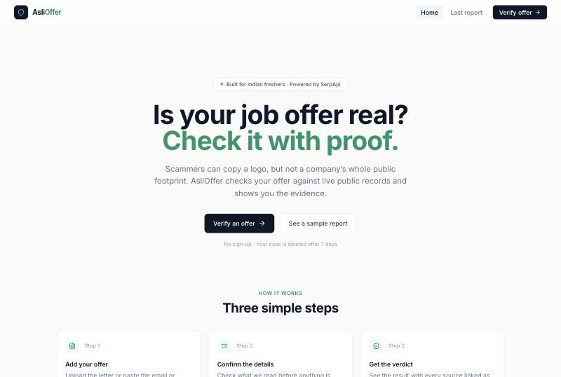
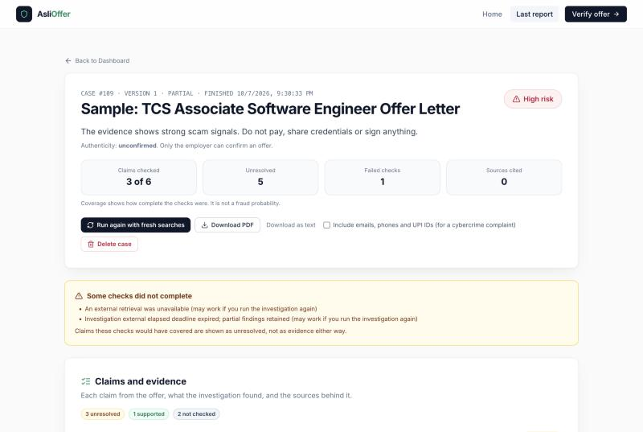
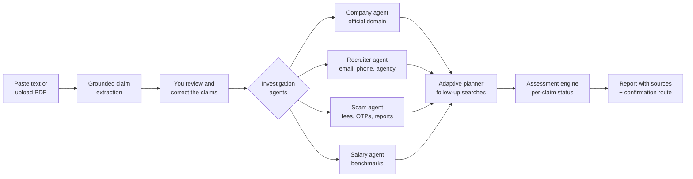
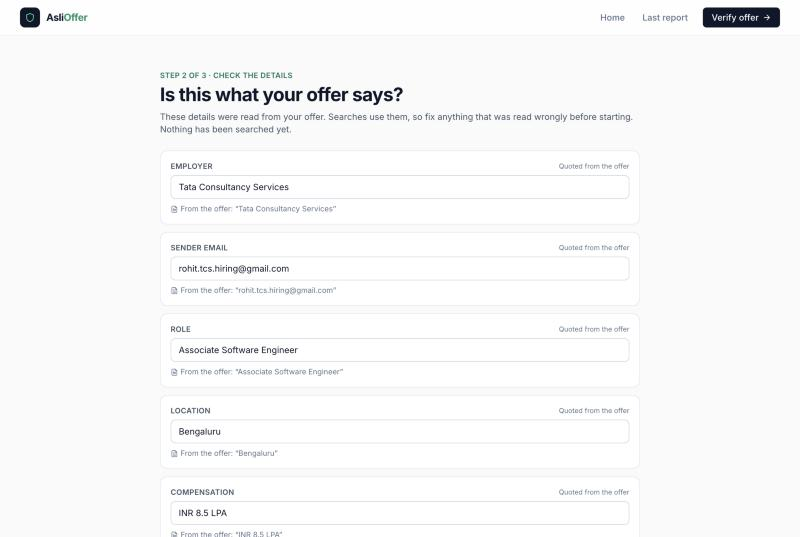
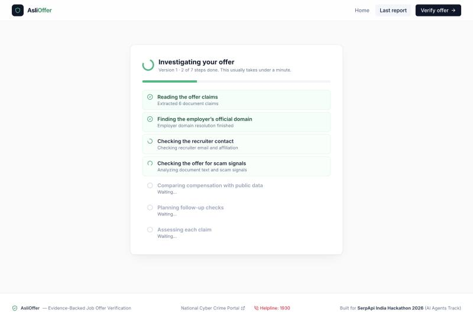
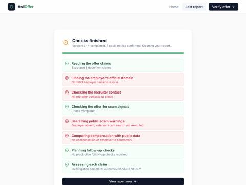

# AsliOffer — Is your job offer real? Check it with proof.

[](https://serpapi.com)
[](#how-it-works)
[](https://aslioffer.vercel.app)
[](#quality-and-evaluation)
[](#quality-and-evaluation)

> **Scammers can copy a company's logo. They cannot copy its whole public footprint.**
>
> AsliOffer reads a job or internship offer, pulls out every claim it makes, and checks those claims
> against **live Google results via SerpApi** — the employer's real website, the recruiter's email domain,
> public scam reports, salary benchmarks and real job postings. It then shows a verdict **with every source linked**,
> and tells you how to confirm the offer with the real employer.

**Live demo:** [aslioffer.vercel.app](https://aslioffer.vercel.app) · No sign-up · Cases are deleted after 7 days

<p align="center">
  
  
</p>

---

## The problem

Every year lakhs of Indian students and freshers receive fake job and internship offers on WhatsApp,
Telegram, email and LinkedIn. They borrow trusted names — TCS, Infosys, Wipro — and follow one script:

1. "Your profile has been shortlisted" (you never applied).
2. A quick chat "interview" on WhatsApp or Telegram.
3. A polished offer letter with a realistic CTC.
4. **The catch:** a "refundable" laptop deposit, training fee or verification charge — paid by UPI.
5. The recruiter disappears.

A fresher has no quick, trustworthy way to check. Searching manually takes skill, and most "is this a scam?"
tools just guess from the wording.

## Our insight

A real offer leaves a public trail; a fake one breaks it somewhere.

| What we check | Genuine offer | Typical scam |
|---|---|---|
| Sender email | The employer's own domain | Gmail/Outlook, or a lookalike domain |
| Employer website | Resolves to one official domain | Name only appears on job-board spam |
| Payment | Never asks for money | "Refundable" deposit via UPI / QR |
| Credentials | Never asks for OTPs or bank logins | Asks for OTP, net-banking, "verification" |
| Public reports | No fraud warnings | Scam complaints on forums and news |
| Salary and role | Consistent with public data | Inflated bait, no matching vacancy |

AsliOffer turns each of these into a **claim**, checks it against live evidence, and is honest when it cannot tell.

---

## How it works



1. **Add your offer** — paste an email/WhatsApp message or upload a PDF. Text is read locally; nothing is searched yet.
2. **Check the details** — every extracted claim is shown with the exact quote it came from. Fix anything that was misread.
   Scam signals (payment and credential requests) are read-only so they cannot be edited away.
3. **Investigate** — four agents run against live SerpApi results inside a fixed budget
   (max 10 searches, 3 follow-ups, 3 in parallel, 30 s search deadline). Progress is streamed step by step from real events.
4. **Get the verdict** — each claim is marked *Supported*, *Contradicted*, *Unresolved* or *Not checked*,
   with linked sources, plus a draft message to confirm the offer through an independently found channel.

<p align="center">
  
  
  
</p>

### The four outcomes

AsliOffer never says an offer is "genuine" — only the employer can confirm that.

| Outcome | Meaning |
|---|---|
| 🔴 **High risk** | Strong scam evidence (fee demand, OTP/credential request, impersonation). Do not pay or share anything. |
| 🟠 **Needs review** | Some claims conflict with public evidence. Confirm with the employer before acting. |
| ⚪ **Cannot verify** | Not enough independent evidence either way. Not proof of a scam. |
| 🟢 **No strong risk signals** | Checks found no strong warnings. Still confirm directly with the employer. |

### How SerpApi is used

Every external fact comes from a live Google search through SerpApi. Examples of queries the agents build:

| Agent | Example query | Why |
|---|---|---|
| Company | `Infosys Limited official website` + `Infosys Limited` | Resolve the one official domain (with Google's entity card) |
| Recruiter | `"rohit.tcs.hiring@gmail.com" scam fraud complaint` | Find public reports of that exact contact |
| Recruiter | `"<agency>" official website` | Check a staffing agency is real and authorised |
| Scam | `"Tata Consultancy Services" job scam fraud complaint telegram` | Find impersonation warnings |
| Salary | `"Systems Engineer" salary "Infosys" AmbitionBox Glassdoor` | Compare the CTC with public data |
| Planner | `site:<official-domain> "<role>"` | Look for the vacancy on the employer's own site |

Searches run as from India (`gl=in`, `google.co.in`), results are cached per run (a repeated query costs nothing),
every query is recorded in the report's tool trace, and **a failed search is reported as failed — no mock or demo
data is ever substituted in a real report.**

---

## What makes it different

- **Grounded, not guessed.** Every claim carries the exact character span it was quoted from, and the report contract
  rejects any search step that cites evidence it did not actually retrieve.
- **Context-aware scam detection.** "Infosys *never* asks for fees" or a quoted scam warning is *not* flagged;
  "deposit ₹15,000 via UPI" is.
- **Lookalike-domain defence.** Punycode homoglyphs, `tcs.com.attacker.example` subdomain tricks,
  `tcs-careers-portal` style names and multi-part suffixes like `.co.in` are all handled by one resolver.
- **Finds big employers' real domains — but not a scammer's.** A domain is accepted as official only when it is the
  single brand-named domain dominating the search *and* Google has an entity card for that company. Infosys, TCS, Wipro
  and Accenture resolve; a made-up company that ranks for its own name does not.
- **Honest uncertainty.** If search fails or evidence is thin, the report says *Cannot verify* and lists which checks
  did not complete — instead of inventing a verdict.
- **Human in the loop.** You confirm or correct the extracted details before any search runs.
- **Adaptive, budgeted agents.** After the first pass a planner decides which gaps are worth a follow-up search, within a
  hard search and time budget.
- **Real progress, not a fake spinner.** Each step is shown as it really happens: green ✓ when completed,
  red ✗ when a check failed or its data was not found.
- **Privacy by design.** Aadhaar, PAN, card, bank-account numbers and OTPs are redacted before any search.
  Each case is locked to the uploading browser with a secret token, auto-deleted after 7 days, and can be deleted at once.
- **Action, not just a verdict.** Download the report as PDF or text (optionally including emails, phones and UPI IDs
  for a cybercrime complaint), and use the draft to confirm the offer with the real employer.

---

## Quality and evaluation

| Check | Result |
|---|---|
| Backend tests (`pytest`) | **661 passing** |
| Offline evaluation corpus | **27 / 27 cases pass**, 100% safety invariants |
| Legitimate offers marked High risk | **0 / 9** |
| Fee / OTP threats missed | **0 / 5** |

The evaluation runs the real investigation pipeline over 27 labelled scenarios (fee demands, OTP requests, task scams,
impersonation, authorised agencies, negated policies, provider outages, deadline timeouts, …) with networking blocked.
Report: [`backend/app/evaluation/output/evaluation_summary.md`](backend/app/evaluation/output/evaluation_summary.md).
These are synthetic regression cases, not real-world accuracy figures.

```bash
cd backend && python -m pytest -q             # unit + integration tests
cd .. && python -m backend.app.evaluation.runner   # offline evaluation corpus
```

---

## Tech stack

- **Frontend:** React 18, TypeScript, Vite, Tailwind CSS, React Router — deployed on Vercel
- **Backend:** Python, FastAPI, SQLModel (SQLite by default, PostgreSQL supported) — deployed on Render
- **Search:** SerpApi (Google engine) for every external fact
- **Delivery:** Docker / Docker Compose, Render blueprint (`render.yaml`), versioned API contract

## Run it locally

**Prerequisites:** Python 3.12+, Node.js 20+, a [SerpApi key](https://serpapi.com/manage-api-key).

```bash
git clone https://github.com/jaypatel345/aslioffer.git
cd aslioffer

# Backend
cd backend
python -m venv .venv && source .venv/bin/activate   # Windows: .venv\Scripts\activate
pip install -r requirements.txt
cp .env.example .env                                # add SERPAPI_API_KEY
uvicorn app.main:app --reload --port 8000

# Frontend (new terminal)
cd frontend
npm install
npm run dev                                         # http://localhost:5173
```

Or with Docker: `cp .env.example .env && docker compose up --build`, then open http://localhost:3000.

### Environment variables

| Variable | Purpose | Default |
|---|---|---|
| `SERPAPI_API_KEY` | Live Google search. Without it, searches fail visibly | — |
| `DATABASE_URL` | Database connection | `sqlite:///./aslioffer.db` |
| `SEARCH_TIMEOUT_SECONDS` | Per-request search timeout | `15` |
| `INVESTIGATION_SEARCH_DEADLINE_SECONDS` | Time limit for all searches in one investigation | `30` |
| `SEARCH_COUNTRY` / `SEARCH_GOOGLE_DOMAIN` | Search locale | `in` / `google.co.in` |
| `RUN_TIMEOUT_SECONDS` | Hard limit for one investigation | `90` |
| `MAX_UPLOAD_BYTES` / `MAX_TEXT_CHARS` | Upload limits | 5 MB / 20,000 |
| `CASE_RETENTION_DAYS` | Cases are deleted this many days after upload | `7` |
| `VITE_API_BASE_URL` | Backend URL for the frontend (build time) | `http://localhost:8000` |

## API

| Method | Endpoint | Description |
|---|---|---|
| `POST` | `/offers/upload` | Upload a PDF or text; returns the case ID and a one-time access token |
| `GET` | `/offers/{id}/claims` | Locally extracted claims for review (no search) |
| `POST` | `/analysis/run` | Start (or reuse) an investigation |
| `GET` | `/analysis/runs/{run_id}` | Poll status and real progress events |
| `GET` | `/offers/{id}/report` | Latest finished report |
| `GET` | `/offers/{id}/runs` | Every report version |
| `DELETE` | `/offers/{id}` | Delete the case and all its reports |

Case routes require the `X-Case-Token` header from upload. Full contract: [docs/api-contract.md](docs/api-contract.md) ·
Swagger UI at `/docs`.

## Repository layout

```
backend/app/
  api/v1/routers/        offers, analysis (runs), health
  services/extractor/    grounded claim extraction (quotes + character spans)
  services/agents/       company, recruiter, salary, scam agents + scam classifier
  services/search/       SerpApi client, domain resolver (lookalike defence)
  services/investigation/ pipeline, adaptive planner, budget, corroborator, assessor
  services/risk/         assessment engine and verdict reasoning
  services/privacy/      redaction and case-token access
  services/runs/         persisted, versioned investigation runs
  evaluation/            27-case offline evaluation corpus and runner
frontend/src/
  pages/                 Upload → ClaimReview → OfferReport
  components/            RunProgress, InvestigationReport, ConfirmationPanel
docs/                    architecture, API contract, design notes per task
```

## Known limitations

- **Screenshots are not read yet.** Images are refused rather than sent to an external vision model without
  explicit consent; paste the text or upload a text PDF instead.
- **"Cannot verify" is common, by design.** Even when the employer's domain is found, a recruiter email or vacancy that
  is not publicly corroborated stays unresolved — an address typed into a message proves nothing on its own.
- **Live search latency.** Uncached SerpApi queries can take 5–15 s; a run stops searching at 30 s and reports any
  check that did not finish.
- The free Render instance sleeps when idle, so the first request after a pause can take up to a minute.

## Roadmap

- Consent-based screenshot reading (OCR / vision) for WhatsApp images
- Gmail and WhatsApp / Telegram forwarding bot
- One-click draft for the National Cyber Crime Reporting Portal
- Shared registry of reported scam numbers, UPI IDs and domains

## Team

Built for the **SerpApi India Hackathon 2026 — AI Agents track** by
[Jay Patel](https://github.com/jaypatel345) and [shriza1991](https://github.com/shriza1991).

If you have been targeted by a job scam in India, call the cybercrime helpline **1930** or report at
[cybercrime.gov.in](https://cybercrime.gov.in).
