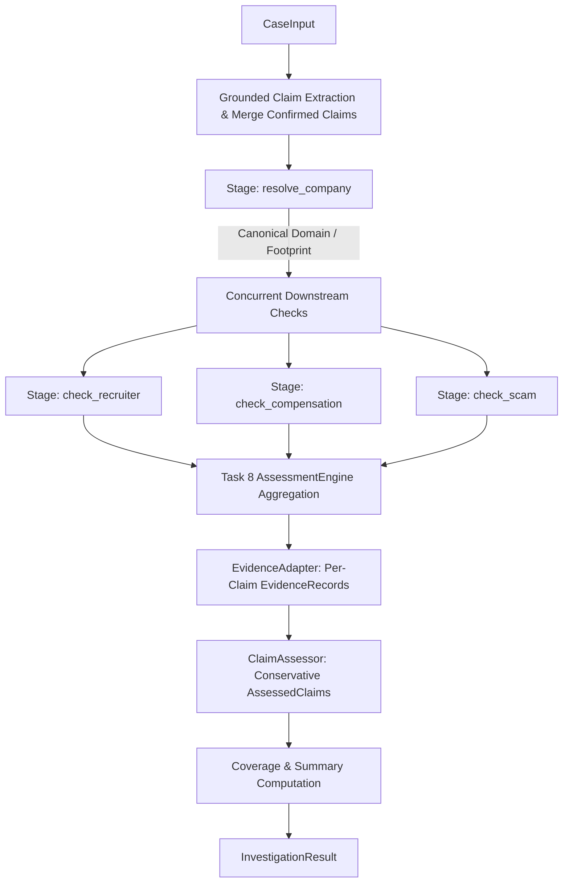

# Task 10: Unified Investigation Pipeline with Contract-v1 Results

## 1. Overview & Service Entry Point

Task 10 implements the unified, offline-testable investigation orchestration pipeline for AsliOffer. It receives a `CaseInput` contract model and returns a validated `InvestigationResult` adhering strictly to contract-v1 (`backend/app/schemas/contract.py`).

The pipeline is completely isolated from HTTP requests, FastAPI middleware, database models (`Offer`, `RunSnapshot`), and background worker queues. Jay owns persistence and HTTP routing in J3; Task 10 provides the pure domain investigator.

### Primary Entry Point

Located in [`backend/app/services/investigation/pipeline.py`](file:///c:/Users/dyara/aslioffer/backend/app/services/investigation/pipeline.py) and exported from [`backend/app/services/investigation/__init__.py`](file:///c:/Users/dyara/aslioffer/backend/app/services/investigation/__init__.py):

```python
async def investigate_case(
    case_input: CaseInput,
    search_client: Optional[Any] = None,
    emit_event: Optional[Callable[[RunEvent], Awaitable[None]]] = None,
) -> InvestigationResult:
    """
    Executes an investigation run for a single case and returns a contract-v1 result.
    
    Parameters:
    - case_input: Input document buffer (redacted_text), case/run IDs, and confirmed claims.
    - search_client: Optional SerpApiClient or fixture mock. If omitted, default SerpApiClient() is used.
    - emit_event: Optional async callback for streaming RunEvent updates during execution.
    """
```

---

## 2. Stage Dependencies & Execution Flow

The pipeline executes in sequential and concurrent stages respecting real causal dependencies:



1. **Extraction & Claim Synthesis**:
   - `GroundedParser` extracts employer, contacts, compensation, and payment demands from `case_input.redacted_text`.
   - `ScamClassifier` extracts document scam signals (e.g. upfront fee, UPI demands).
   - Missing essential claims (`EMPLOYER`, `PAYMENT_REQUEST`) are synthesized with `ExtractionStatus.MISSING`.
   - User confirmations (`case_input.confirmed_claims`) are merged: duplicate IDs are rejected; user-edited values clear document source quotes and offsets.

2. **Sequential Stage: `resolve_company`**:
   - Runs `CompanyAgent.investigate(company_name)`.
   - Resolves canonical corporate domain, careers URL, and footprint evidence via `DomainResolver`.
   - In-memory search cache prevents redundant company queries downstream.

3. **Concurrent Downstream Stages**:
   - Runs `asyncio.gather(run_recruiter(), run_salary(), run_scam(), return_exceptions=True)`.
   - `check_recruiter`: Runs `RecruiterAgent.investigate`. If recruiter contact is missing or redacted, safely skipped.
   - `check_compensation`: Runs `SalaryAgent.investigate`. If no compensation extracted, safely skipped.
   - `check_scam`: Runs `ScamAgent.investigate` for adverse web footprint and combines with local scam signals.

4. **Failure Isolation & Outcome Assessment**:
   - Isolated agent crashes are logged and added to `errors` as `RunError(code="AGENT_CHECK_FAILURE")` without discarding other agents' evidence or local scam findings.
   - Outcome computed via `AssessmentEngine.assess_findings()` preserving Task 8 precedence (`HIGH_RISK` > `SUSPICIOUS` > `CANNOT_VERIFY` > `NO_STRONG_RISK_SIGNALS`).

5. **Conservative Claim Assessment & Coverage**:
   - Every returned claim receives an `AssessedClaim`.
   - Claims are mapped to evidence adhering to strict referential integrity.
   - `Coverage` metrics are calculated based on returned claims.

---

## 3. Injected Search Client & `RecordingSearchClient`

The pipeline wraps any provided search client with [`RecordingSearchClient`](file:///c:/Users/dyara/aslioffer/backend/app/services/investigation/recording_search.py):

- **Provenance Tracking**: Captures search query, engine (`google`), latency (`duration_ms`), search ID, retrieval timestamp, and maps snippets by URL.
- **In-Memory Query Normalization & Caching**: Canonicalizes search queries (e.g., lowercased, whitespace normalized) so that identical queries shared between `CompanyAgent` and `RecruiterAgent` execute the underlying search only once.
- **Demo Isolation**: If `case_input.demo_mode == False`, synthetic `DEMO` search responses are rejected and flagged as `FAILED` to prevent demo data from masquerading as live verification.
- **Tool Traces**: Accumulates genuine `ToolCall` records for every underlying search invocation.

---

## 4. Claim, Evidence, and Status Mappings

### Claim Determinism & Integrity
- Claim IDs are deterministic within a run (`c1`, `c2`, `c3`, ...).
- Semantic contact roles are strictly separated: candidate email/phone is never classified as recruiter contact.
- Exact offsets `[start_offset, end_offset)` are validated against `redacted_text`. If offsets do not match or the claim was user-edited, offsets and source quotes are set to `None`.

### Evidence Adaptation
- Every `EvidenceRecord` belongs to exactly **one** `claim_id`. Unrelated agent evidence is never cross-attached.
- Document-level observations use `source_kind=SourceKind.DOCUMENT`, `source_tier=SourceTier.OFFER_DOCUMENT`, and `source_url=None`.
- External snippets use `source_kind=SourceKind.SEARCH_SNIPPET` and maintain honest `source_tier` (`OFFICIAL_EMPLOYER`, `GOVERNMENT`, `ESTABLISHED_THIRD_PARTY`, `USER_GENERATED`, or `UNKNOWN`).
- Failed search retrievals use `retrieval_status=RetrievalStatus.FAILED` and relation `EvidenceRelation.CONTEXT`.

### Claim Status Rules
| Claim Kind | Condition | Claim Status | Reason Code |
| :--- | :--- | :--- | :--- |
| `EMPLOYER` | Official domain resolved + official evidence | `SUPPORTED` | `OFFICIAL_DOMAIN_RESOLVED` |
| `EMPLOYER` | Sparse/unverified footprint | `UNRESOLVED` | `SPARSE_FOOTPRINT` |
| `EMPLOYER` | Upstream search provider outage | `UNRESOLVED` | `SEARCH_UNAVAILABLE` |
| `SENDER_EMAIL` | Domain aligns with verified employer domain | `SUPPORTED` | `DOMAIN_ALIGNED` |
| `SENDER_EMAIL` | Free email provider (e.g. Gmail) | `CONTRADICTED` | `FREE_MAIL_PROVIDER` |
| `SENDER_EMAIL` | Domain lookalike / spoof detected | `CONTRADICTED` | `LOOKALIKE_DOMAIN` |
| `SENDER_EMAIL` | Employer domain unconfirmed | `UNRESOLVED` | `CANNOT_VERIFY_DOMAIN` |
| `PAYMENT_REQUEST` | Upfront fee / registration / UPI demand in text | `CONTRADICTED` / `UNRESOLVED` | `UPFRONT_PAYMENT_DEMAND` |
| `PAYMENT_REQUEST` | No payment requested in document | `UNRESOLVED` | `NO_PAYMENT_DEMANDED` |
| `COMPENSATION` | Comparable market benchmarks found | `SUPPORTED` | `BENCHMARK_ALIGNED` |
| `COMPENSATION` | Fixed band heuristic only (no external snippets) | `UNRESOLVED` | `UNVERIFIED_BENCHMARK` |
| `ROLE` | Document extracted without external corroboration | `UNRESOLVED` | `UNVERIFIED_ROLE` |

**Authenticity Rule**: `InvestigationResult.authenticity_status` is ALWAYS `UNCONFIRMED`. No public web search or domain alignment can prove letter authenticity.

---

## 5. Coverage Definitions

Contract coverage counts **claims**, not Task 8 internal checks:
- `total_claims`: Number of claims returned in `InvestigationResult.claims`.
- `checked_claims`: Number of claims whose corresponding check executed.
- `unresolved_claims`: Number of claims whose `AssessedClaim.status` is `UNRESOLVED` or `NOT_CHECKED`.
- `failed_checks`: Distinct count of failed checks/stages (from `result.errors`).

> Note: A completed check may leave a claim `UNRESOLVED` (e.g., sparse startup). Such a claim is counted in both `checked_claims` and `unresolved_claims`. Missing essential claims (e.g. absent payment request) count towards `total_claims` but not `checked_claims`.

---

## 6. Redaction Boundary & Confirmed Claims

- `case_input.redacted_text` is the canonical document buffer. Unredacted text is never fetched or restored.
- Placeholders such as `[EMAIL_1]`, `[PHONE_1]`, or `[CANDIDATE_NAME_1]` are recognized as redaction tokens. They are never sent to search engines or models.
- If a recruiter contact is redacted, `check_recruiter` is marked `SKIPPED`.
- In `confirmed_claims`:
  - `USER_CONFIRMED`: Acknowledges user input; does not confer third-party verification.
  - `USER_EDITED`: User-provided values are validated, but document quote and offsets are stripped.
  - Duplicate confirmation IDs are rejected immediately with `ValueError`.

---

## 7. Failure, Cancellation, and Event Streaming

- **Event Emission**: When `emit_event` is provided, `RunEvent` records are emitted with monotonically increasing sequence numbers (0, 1, 2, ...).
- **Public Message Sanitization**: Sensitive query strings and API keys are stripped from `public_message`.
- **Callback Isolation**: If the caller's `emit_event` callback raises an exception, it is caught and logged. It does not abort the investigation or alter the outcome.
- **Cancellation Propagation**: `asyncio.CancelledError` is explicitly caught and re-raised, triggering cleanup of concurrent subtasks.
- **Provider Outage**: Search rate-limits or HTTP 5xx errors produce an error record (`PROVIDER_OUTAGE`) and yield an overall outcome of `CANNOT_VERIFY`, while preserving local scam signals.

---

## 8. Handoff to Jay's J3 Run Service

Jay can integrate `investigate_case` directly into the J3 background worker or endpoint:

```python
from app.services.investigation import investigate_case
from app.schemas.contract import CaseInput, RunEvent

async def run_investigation_worker(case_input: CaseInput, run_snapshot_repo):
    async def on_event(event: RunEvent):
        await run_snapshot_repo.append_event(case_input.run_id, event)

    result = await investigate_case(
        case_input=case_input,
        search_client=serpapi_client,
        emit_event=on_event,
    )

    await run_snapshot_repo.save_completed(case_input.run_id, result)
```

No changes to `investigate_case` are needed for persistence.

---

## 9. Deferred Task 11 and 12 Work

- **Task 11 (Adaptive Planning)**: Follow-up search refinement, ambiguous company disambiguation loops, and query rewriting are deferred to Task 11. Task 10 performs single-pass resolution.
- **Task 12 (Job/Offer Confirmation & Authentic Channels)**: Confirmation routes remain `None` unless an independently sourced, employer-published careers portal is corroborated by search evidence. Active verification portal discovery and candidate outreach drafting belong to Task 12.
