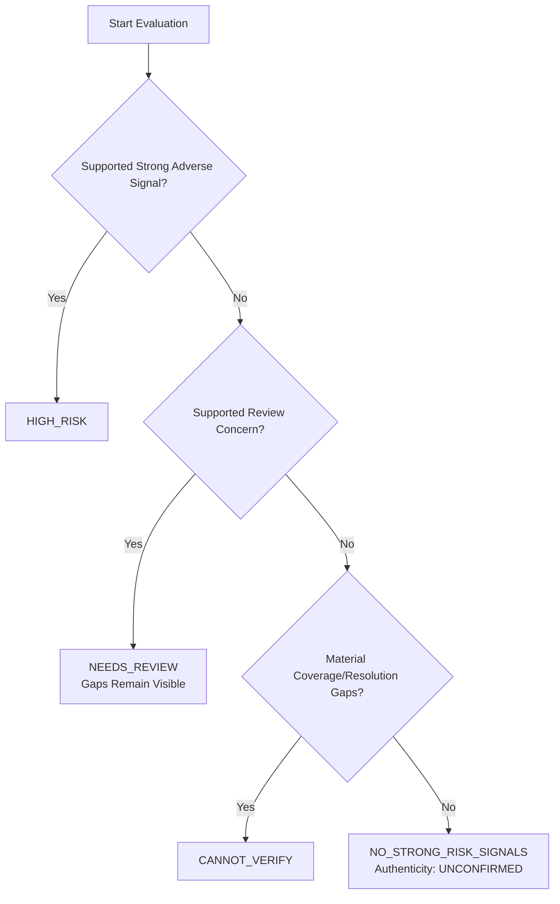

# Task 8: Separate Warning Strength, Investigation Coverage, and Offer Authenticity

## 1. Overview & Core Philosophy

Task 8 replaces AsliOffer's conflated "fraud risk score" with a single coherent assessment policy that answers three distinct forensic questions:

1. **Warning strength**: What supported adverse signals or review concerns were detected?
2. **Investigation coverage**: Which applicable checks ran, which failed or were unavailable, and what remains unresolved?
3. **Offer authenticity**: Has the employer actually authenticated this specific offer? (Always `UNCONFIRMED` in the current pipeline).

These three dimensions are **never** combined into a supposed fraud probability or authenticity percentage.

---

## 2. Outcome Precedence Policy

Both [`RiskEngine`](../backend/app/services/risk/risk_engine.py) and [`VerdictReasoner`](../backend/app/services/risk/verdict_reasoner.py) delegate to the unified [`AssessmentEngine`](../backend/app/services/risk/assessment_engine.py), enforcing strict outcome precedence:



### Precedence Tiers

1. **`HIGH_RISK`**:
   - Triggered when at least one supported strong adverse signal is detected (e.g., upfront fee, security deposit demand, bank OTP/password theft, unlock-earnings scheme, or phone/email flagged in public cybercrime databases).
   - High-risk signals remain `HIGH_RISK` even if external search providers suffer outages.

2. **`NEEDS_REVIEW`**:
   - Triggered when no strong adverse signal exists, but at least one supported contextual concern requires secondary human confirmation (e.g., personal webmail domain `@gmail.com` for corporate role, sender domain mismatch, unconfirmed third-party agency mandate, salary outlier).
   - Review concerns alone **never** cross into `HIGH_RISK`. Multiple weak concerns combined (e.g. personal email + salary outlier) remain `NEEDS_REVIEW`.
   - Coverage gaps remain visible in `unresolved_issues` and check-level summaries.

3. **`CANNOT_VERIFY`**:
   - Triggered when no strong adverse signals or review concerns exist, but material coverage or resolution gaps prevent positive verification (e.g., search provider outages, zero search results on employer identity, missing essential recruiter contact, unconfirmed recruiter affiliation).
   - Missing evidence and provider outages **never** add fraud-risk points or create adverse flags.

4. **`NO_STRONG_RISK_SIGNALS`** (Maps to legacy `RiskLevel.VERIFIED` for backward compatibility):
   - Triggered only when no strong signals or review concerns exist **and** all essential applicable checks completed cleanly:
     - Local document scan completed with no scam patterns.
     - Company identity check completed with supported corporate web presence.
     - External scam search completed with no adverse company reports.
     - Recruiter contact verified or clean with no adverse reports.
   - Authenticity status remains strictly **`UNCONFIRMED`**.

---

## 3. Signal-Strength Policy & Uncalibrated Warning Index

### Supported Strong Adverse Signals (`WarningSeverity.STRONG_ADVERSE`)
- `ADVANCE_FEE_DETECTED` / `UPFRONT_FEE_DEMAND`: Demands for registration fees, onboarding charges, or laptop deposits.
- `UNLOCK_PAYMENT_DETECTED` / `UNLOCK_PAYMENT_DEMAND`: Demands for payment to release earned wages or unlock job tasks.
- `CREDENTIAL_THEFT_DETECTED` / `CREDENTIAL_THEFT_DEMAND`: Solicitation of bank OTPs, account passwords, or net-banking credentials.
- `ADVERSE_PHONE_REPORT`: Recruiter phone number appears in public complaint or cybercrime scam reports.
- `ADVERSE_EMAIL_REPORT`: Recruiter email address appears in public complaint or cybercrime scam reports.

### Contextual Review Concerns (`WarningSeverity.REVIEW_CONCERN`)
- `FREE_WEBMAIL_DOMAIN` / `PERSONAL_EMAIL_DOMAIN`: Recruiter uses a free webmail domain (e.g. `@gmail.com`, `@yahoo.com`) for corporate hiring.
- `RECRUITER_DOMAIN_MISMATCH`: Recruiter email domain does not match employer official domain.
- `AGENCY_MANDATE_UNCONFIRMED`: Staffing agency footprint recognized, but client representation mandate requires confirmation.
- `AGENCY_AFFILIATION_UNCONFIRMED`: Agency partnership supported, but individual recruiter affiliation with agency is unconfirmed.
- `SALARY_OUTLIER`: Offered compensation is unusually high for role and may be used as bait.
- `CANDIDATE_PAYMENT_DETECTED`: Candidate payment requested via UPI or mobile wallet without confirmed fee demand.
- `TELEGRAM_UNVERIFIED_CHANNEL`: Recruitment conducted via informal Telegram messaging without verifiable corporate presence.

### Warning Strength Index (Legacy `risk_score` Mapping)
- The legacy `risk_score` is redefined as an **uncalibrated warning index** (bounded between `0.0` and `1.0`).
- The artificial minimum of `0.05` is completely removed: clean checks or provider outages with zero supported adverse signals have warning strength `0.0`.
- **`HIGH_RISK`**: Warning index is `0.70` to `0.98` (`WarningBand.HIGH`).
- **`NEEDS_REVIEW`**: Warning index is `0.25` for single concern, `0.35` for multiple concerns, capped at `0.40` (`WarningBand.MEDIUM`). Review concerns alone can never reach `0.50`.
- **`CANNOT_VERIFY`**: Warning index is `0.0` (`WarningBand.NONE`). Outages and gaps do not add fraud points.
- **`NO_STRONG_RISK_SIGNALS`**: Warning index is `0.0` (`WarningBand.NONE`).

---

## 4. Explicit Check-Level Coverage & Denominator Policy

Coverage is tracked across 7 concrete investigation checks in [`CheckCoverageItem`](../backend/app/services/risk/assessment_models.py):

| Check ID | Check Name | Performing Agent | Applicable When |
| :--- | :--- | :--- | :--- |
| `LOCAL_DOCUMENT_SCAN` | Local Document Scam Pattern Scan | `ScamAgent` | Always (document text available) |
| `EXTERNAL_SCAM_REPORTS` | Public Complaint & Scam Search | `ScamAgent` | Always (employer claimed) |
| `COMPANY_IDENTITY_CHECK` | Employer Identity & Web Presence Check | `CompanyAgent` | Always (employer claimed) |
| `RECRUITER_CONTACT_REPUTATION` | Recruiter Contact Adverse Reports Check | `RecruiterAgent` | Always (essential contact check) |
| `RECRUITER_AFFILIATION_CHECK` | Recruiter Domain Alignment & Affiliation | `RecruiterAgent` | Always (essential affiliation check) |
| `AGENCY_AUTHORIZATION_CHECK` | Staffing Agency Mandate Check | `RecruiterAgent` | Only if agency is claimed/detected |
| `COMPENSATION_BENCHMARK` | Market Compensation Plausibility Benchmark | `SalaryAgent` | Only if annual salary specified |

### Check States
- **Execution Status**: `completed`, `unavailable`, `not_checked`, `not_applicable`.
  - A completed empty search is `completed` with `no_match` resolution; it is **not** evidence of legitimacy.
  - Provider timeouts, rate limits, and auth failures are `unavailable`.
  - Demo results (`search_source == "DEMO"`) are excluded from public verification evidence (`unavailable`).
  - Local document scan remains `completed` even if external SerpApi searches fail.
- **Resolution Status**: `supported`, `no_match`, `unconfirmed`, `conflicting`.

### Completion Ratio Definition
$$\text{completion\_ratio} = \frac{\text{completed\_checks}}{\text{applicable\_checks}} \quad (\text{0.0 if } \text{applicable\_checks} = 0)$$
- Count **applicable checks**, not sources, raw URLs, or agents.
- Genuinely optional checks (e.g. agency mandate when no agency was involved, or salary benchmark for monthly stipends) are marked `not_applicable` and excluded from the denominator.
- Missing essential employer or recruiter information is marked `not_checked` with `applicability=True`, preserving visible gaps in coverage.
- The ratio is explicitly **not** described as an authenticity confidence metric.

---

## 5. Authenticity Limitations

- `authenticity_status` is strictly **`UNCONFIRMED`** across the entire current pipeline.
- Company existence, domain alignment, recruiter affiliation, plausible compensation, and clean search results confirm public consistency, **not** individual offer authenticity.
- AsliOffer currently possesses no direct employer authentication API (e.g., enterprise ATS webhook, authorized HR verification portal, cryptographic signature).
- An outcome of `NO_STRONG_RISK_SIGNALS` or legacy `RiskLevel.VERIFIED` **must never** be presented to users as proof that the offer is authentic.

---

## 6. Shared Schemas & Report API Integration

All additions to shared schemas are strictly **additive and backward-compatible**:

In [`VerificationReport`](../backend/app/schemas/analysis.py) and [`VerdictResult`](../backend/app/schemas/analysis.py):
```python
overall_outcome: Optional[OverallOutcome] = None
authenticity_status: Optional[AuthenticityStatus] = AuthenticityStatus.UNCONFIRMED
warning_band: Optional[WarningBand] = None
structured_assessment: Optional[StructuredAssessment] = None
```

Existing fields (`risk_level`, `risk_score`, `findings`, `red_flags`, `green_flags`, `reason_details`, `summary`, `recommended_actions`) remain intact and functional.

---

## 7. Frontend Handoff for Jay

When updating the UI, Jay should display the three dimensions separately:

1. **Warning Level Badge & Warning Band**:
   - Use `report.overall_outcome` (`HIGH_RISK`, `NEEDS_REVIEW`, `CANNOT_VERIFY`, `NO_STRONG_RISK_SIGNALS`).
   - If rendering `report.risk_score`, display it as `"Warning Index: X/100 (Uncalibrated signal strength)"`, **never** as `"Fraud Probability: X%"`.
   - Display `report.warning_band` (`HIGH`, `MEDIUM`, `LOW`, `NONE`).

2. **Investigation Coverage Component**:
   - Access `report.structured_assessment.coverage_summary`:
     - `completion_ratio`: Display as `"Investigation Coverage: X%"` (checks executed vs applicable).
     - Display `completed_checks` of `applicable_checks`.
     - Display `unresolved_issues` as an explicit bulleted checklist of unverified items or provider outages.
   - Access `report.structured_assessment.individual_checks`:
     - Render each check with its name, `execution_status`, and `resolution_status`.

3. **Offer Authenticity Notice**:
   - Prominently display `report.authenticity_status` (`UNCONFIRMED`).
   - For clean checks (`NO_STRONG_RISK_SIGNALS` / `VERIFIED`), display the disclaimer banner:
     > *"Important: While public records align with standard practices, the employer has not authenticated this individual offer letter. Always verify your offer reference code directly with the company before taking action."*

### Legacy Field Mapping
| Legacy Field | New Assessment Source | UI Recommended Treatment |
| :--- | :--- | :--- |
| `report.risk_level` | `report.overall_outcome` | Primary status indicator |
| `report.risk_score` | `report.structured_assessment.warning_strength` | Warning strength index (0.0 to 1.0) |
| `report.red_flags` | `supported_warning_signals` + `review_only_concerns` | Adverse alerts and review points |
| `report.green_flags` | Completed checks with supported/clean results | Genuinely completed positive checks |

---

## 8. Deferred Scope (Task 9 & Task 10)

- **Task 9 Scope**: Owns comprehensive report wording cleanup, full narrative adjustments, and detailed action recommendations across all forensic scenarios.
- **Task 10 Scope**: Owns the unified pipeline orchestrator, adaptive search retry strategies, database schema redesign, and asynchronous background worker integration.
